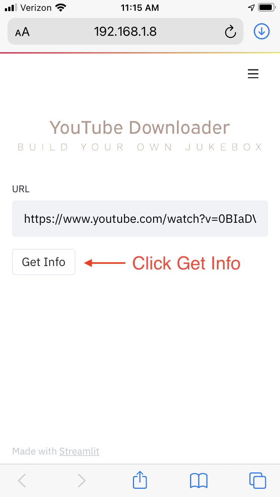
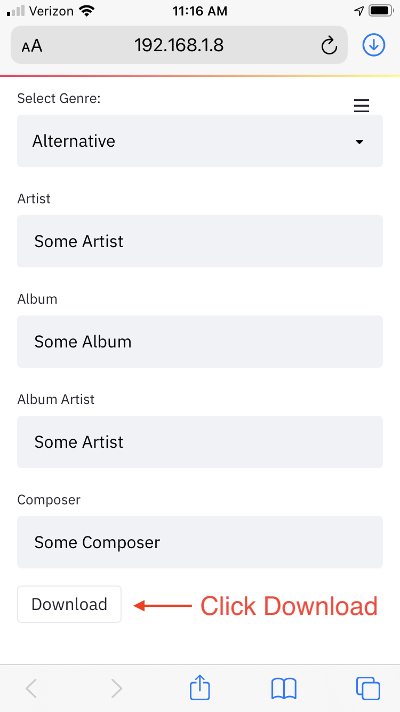
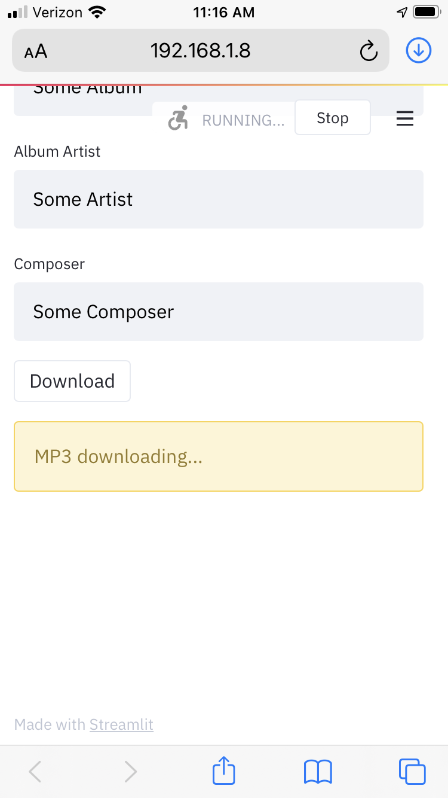
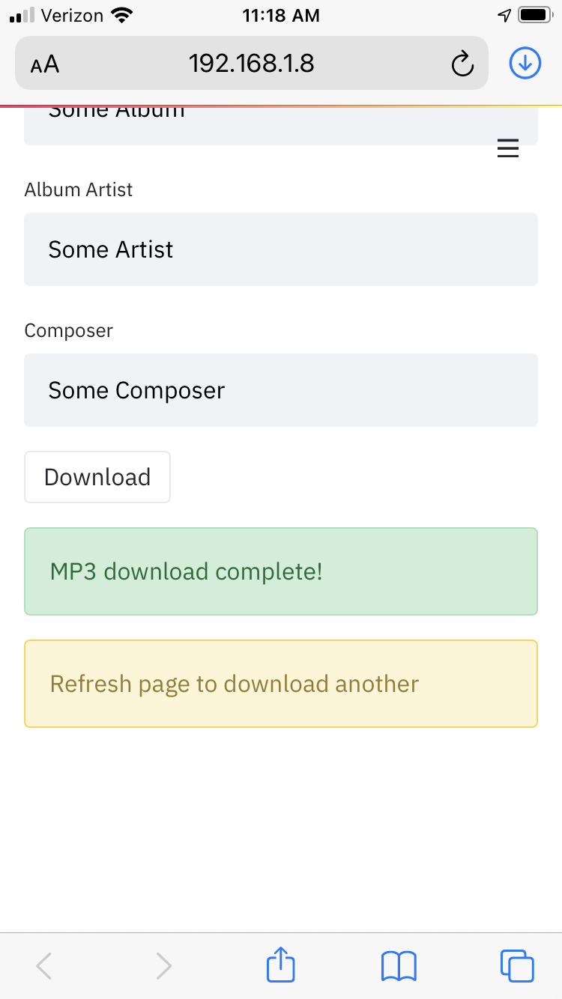

# YouTube MP3 Downloader

### Installation

1. `git clone <this repo>`
1. Create a virtual environment.
1. `pip install -r requirements.txt`
1. `streamlit run app.py`
1. Launch `http://{host}:8501` in a browser.
1. Follow the screenshots below.

